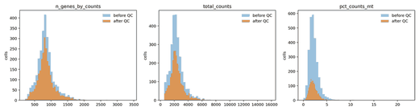
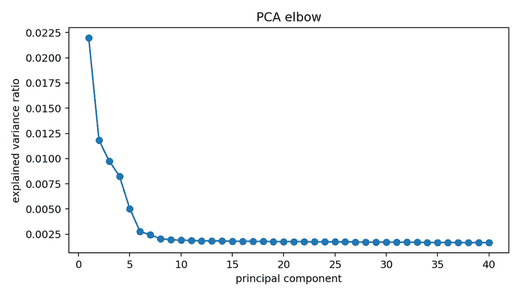
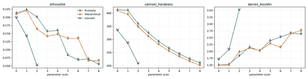
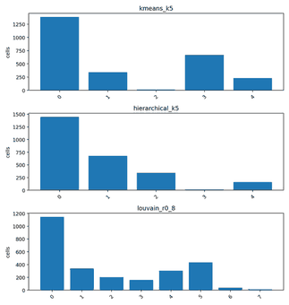
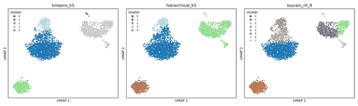
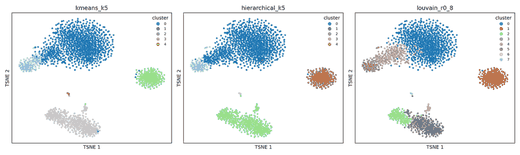
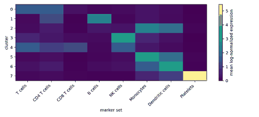
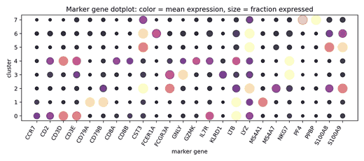

# PBMC 单细胞 RNA-seq 降维与聚类算法比较

作者：同学 A、同学 B  
课程：统计机器学习  
项目类型：算法比较与案例应用  
数据集：PBMC3k 单细胞 RNA-seq 公开数据  
版本：最终报告 Markdown 版

## 摘要

单细胞 RNA-seq 数据通常具有高维、稀疏、噪声较强等特点，是检验降维与聚类方法的典型应用场景。本项目使用公开 PBMC3k 数据，围绕“经典统计机器学习方法能否从高维单细胞表达矩阵中发现具有生物意义的免疫细胞亚群”这一问题，以 PCA 作为主要聚类表示，比较 K-means、层次聚类和 Louvain 图聚类，并使用 UMAP/t-SNE 对结果进行二维可视化。数据经过质量控制、归一化、`log1p` 转换、高变基因筛选、标准化和 PCA 后，保留 `2638` 个细胞和 `1838` 个 highly-variable genes/features。实验采用内部聚类指标、随机子采样稳定性和 marker gene 生物解释相结合的评价方式。结果显示，K-means 与层次聚类在 `k=5` 时取得较好的内部指标和稳定性；Louvain 在 `resolution=0.8` 时得到 8 个 cluster，更适合进行 PBMC 主要免疫细胞亚群解释。基于 marker genes，主要 cluster 可解释为 CD4 T cells、T cells、B cells、Monocytes、NK cells、Dendritic cells 和 Platelets。整体来看，统计机器学习中的降维与聚类方法可以从 PBMC 单细胞表达矩阵中恢复有意义的细胞群结构，但最终解释不能只依赖几何聚类指标，仍需结合生物 marker 和领域知识。

关键词：单细胞 RNA-seq；PBMC；PCA；UMAP；t-SNE；K-means；层次聚类；Louvain；marker genes

## 1. 背景与研究问题

外周血单个核细胞（PBMC, peripheral blood mononuclear cells）是血液中具有单个细胞核的免疫细胞集合，常见类型包括 T cells、B cells、NK cells、monocytes 和 dendritic cells 等。PBMC 数据是单细胞 RNA-seq 分析中常用的入门数据集，因为其细胞类型相对明确，且不同免疫细胞通常具有可解释的 marker gene 表达模式。

单细胞 RNA-seq 数据具有典型的高维、小样本相对高特征数、稀疏和噪声强等特点。原始表达矩阵中，一个细胞可对应数万个基因表达特征，直接在原始空间进行聚类往往会受到噪声、测序深度和维数灾难影响。因此，实际分析通常先通过质量控制和特征筛选降低噪声，再使用 PCA 等方法构造低维表示，并在低维表示或细胞邻接图上进行聚类。

本项目的研究问题是：经典统计机器学习方法能否在高维稀疏的单细胞表达矩阵中发现具有生物意义的 PBMC 免疫细胞亚群？围绕这一问题，我们比较了 K-means、层次聚类和 Louvain 图聚类，并结合 marker genes 对聚类结果进行解释。

## 2. 数据与预处理

本项目使用 Scanpy 提供的 PBMC3k 公开数据。该数据来自 10x Genomics 的健康供体 PBMC 单细胞 RNA-seq 实验。项目仓库中不上传 `.h5ad` 原始数据和处理后的 AnnData 文件，因为这类文件体积较大；实验脚本会优先读取本地 `data/pbmc3k_raw.h5ad`，在新环境中也可以通过下载脚本重新获取并复现实验。

预处理流程如下：

1. 读取 PBMC3k 原始表达矩阵。
2. 进行质量控制，过滤低基因数细胞、低出现频率基因和线粒体比例异常细胞。
3. 进行 total-count normalization，使不同细胞之间的测序深度更可比。
4. 对表达值做 `log1p` 转换，降低极端表达值对后续分析的影响。
5. 筛选 highly-variable genes，保留对细胞差异贡献较大的基因。
6. 对表达矩阵进行标准化，并使用 PCA 得到后续聚类的低维表示。

预处理后数据规模为 `2638` cells × `1838` highly-variable genes/features。该规模既保留了主要细胞群结构，也减少了原始高维表达矩阵中的噪声。

图 1 展示质量控制相关指标的分布，用于检查每个细胞检测到的基因数、总 counts 和线粒体比例等指标是否存在明显异常。QC 的作用是减少低质量细胞和技术噪声对聚类结果的影响。

图 2 展示 PCA explained variance 的变化。PCA 将高维基因表达矩阵压缩为低维连续表示，前若干主成分保留了主要方差信息，后续聚类和邻接图构建均基于该表示进行。

## 3. 方法

### 3.1 降维方法

PCA 是本项目的主分析表示。它通过线性正交变换寻找方差最大的方向，适合在聚类前降低维度、去除部分噪声，并提高算法运行效率。PCA 与课程中降维部分直接相关，其核心思想是用较少的主成分近似原始高维数据结构。

UMAP 和 t-SNE 主要用于二维可视化。二者都强调局部邻域结构，可以帮助观察细胞群在二维空间中的分离情况。但二维可视化会受到参数和投影失真的影响，因此本项目不把 UMAP 或 t-SNE 图作为唯一评价依据，而是结合聚类指标、稳定性和 marker gene 表达共同判断结果。

### 3.2 聚类方法

K-means 将细胞划分为 `k` 个簇，并最小化样本到簇中心的平方距离。该方法简单、可解释、运行较快，但默认簇结构接近球形，且需要预先指定 `k`。本项目扫描 `k=4..12`。

层次聚类使用 Ward linkage 构造层次结构，再切分为指定数量的 cluster。与 K-means 相比，层次聚类可以提供树状合并结构，但在样本量较大时计算成本更高。本项目同样扫描 `k=4..12`。

Louvain 是图聚类方法。它先基于细胞在 PCA 空间中的近邻关系构造 KNN 图，再通过最大化 modularity 寻找社区结构。单细胞数据中的细胞类型常表现为非线性流形或局部邻域结构，因此 Louvain 常用于细胞群发现。本项目扫描 `resolution=0.4/0.8/1.2`。

### 3.3 评价指标

本项目使用三类评价：

1. 内部聚类指标：silhouette、Calinski-Harabasz 和 Davies-Bouldin。silhouette 和 Calinski-Harabasz 越高通常表示簇内更紧密、簇间更分离；Davies-Bouldin 越低通常表示聚类结构更好。
2. 稳定性指标：通过随机子采样重复聚类，计算 ARI 和 NMI 的均值与标准差。ARI/NMI 越高、标准差越小，表示结果对采样扰动更稳定。
3. 生物解释：使用 marker genes 检查 cluster 是否对应已知免疫细胞类型。该部分用于弥补无监督内部指标无法提供真实生物标签的不足。

## 4. 实验结果

### 4.1 聚类指标比较

从内部指标看，K-means 和层次聚类在 `k=5` 时表现较好。`kmeans_k5` 的 silhouette 为 `0.222988`，ARI 均值为 `0.995817`，NMI 均值为 `0.991943`；`hierarchical_k5` 的 silhouette 为 `0.220512`，ARI 均值为 `0.984193`，NMI 均值为 `0.971546`。这说明当聚成 5 个较大的群时，PBMC3k 数据在 PCA 表示中具有较清晰的几何结构，并且 K-means 与层次聚类的结果相对稳定。

相比之下，K-means 和层次聚类在 `k` 继续增大时，silhouette 总体下降，Davies-Bouldin 值上升，说明过细切分可能会降低几何聚类质量。对于 Louvain，`resolution=0.4` 得到 6 个 cluster，silhouette 为 `0.198307`；`resolution=0.8` 得到 8 个 cluster，silhouette 为 `0.141799`；`resolution=1.2` 得到 11 个 cluster，silhouette 降至 `0.051901`。这说明 Louvain 的 resolution 越高，cluster 数量越多，但几何紧致性不一定提升。

图 3 对比不同算法和参数下的聚类指标。整体上，`k=5` 的 K-means 和层次聚类在内部指标上较突出；Louvain 的优势不主要体现在 silhouette 最高，而在于能够给出更细的图社区结构，便于后续细胞类型解释。

图 4 展示不同聚类结果下的 cluster size 分布。cluster size 可以帮助检查是否出现过多极小 cluster 或单一 cluster 过大等问题。PBMC 数据中某些细胞类型数量本身较少，因此小 cluster 不一定错误，但需要结合 marker genes 判断其生物意义。

### 4.2 UMAP 与 t-SNE 可视化

UMAP 和 t-SNE 用于观察不同聚类标签在二维空间中的分布。可视化结果显示，PBMC3k 数据存在若干较明显的细胞群区域。K-means 和层次聚类更倾向于将数据划分为几个较大的几何区域；Louvain 在邻接图上寻找社区，因此能进一步拆分出一些较小但具有 marker gene 支持的细胞群。

图 5 展示不同聚类方法在 UMAP 空间中的标签分布。二维图不能替代定量指标，但可以直观呈现不同算法对细胞群边界的划分差异。

图 6 展示不同聚类方法在 t-SNE 空间中的标签分布。t-SNE 更强调局部邻域，因此适合辅助观察局部群落结构，但不同参数可能改变全局距离关系。

## 5. 细胞群解释

最终生物解释基于 `louvain_r0_8`，因为该设置得到 8 个 cluster，既比 `resolution=0.4` 更细，也没有像 `resolution=1.2` 那样产生过多小 cluster。marker gene 注释结果如下：

| Cluster | 建议细胞类型 | 支持 marker genes | 解释 |
| --- | --- | --- | --- |
| 0 | CD4 T cells | IL7R, CCR7, LTB | `IL7R`、`CCR7` 和 `LTB` 常见于 CD4 T/naive 或 memory T cell 相关群体，说明该 cluster 具有 CD4 T cell 特征。 |
| 1 | B cells | MS4A1, CD79A, CD79B | `MS4A1`、`CD79A` 和 `CD79B` 是 B cell 相关 marker，支持该 cluster 注释为 B cells。 |
| 2 | Monocytes | LYZ, S100A8, S100A9, FCGR3A, MS4A7 | `LYZ`、`S100A8`、`S100A9` 与 monocyte/髓系细胞相关，`FCGR3A`、`MS4A7` 进一步支持 monocyte 解释。 |
| 3 | NK cells | GNLY, NKG7, KLRD1 | `GNLY`、`NKG7` 和 `KLRD1` 是 NK cell/cytotoxic 相关 marker，支持 NK cells 注释。 |
| 4 | T cells | CD3D, CD3E, CD2, IL7R | `CD3D`、`CD3E` 和 `CD2` 是 T cell 相关 marker，说明该 cluster 主要为 T cells。 |
| 5 | Monocytes | LYZ, S100A8, S100A9, FCGR3A, MS4A7 | 与 cluster 2 类似，该 cluster 也具有明显 monocyte marker 表达，可能对应 monocyte 的不同亚群或状态。 |
| 6 | Dendritic cells | FCER1A, CST3 | `FCER1A` 和 `CST3` 支持 dendritic cell 相关解释。 |
| 7 | Platelets | PPBP, PF4 | `PPBP` 和 `PF4` 是 platelet 相关 marker，支持该 cluster 注释为 platelets。 |

图 7 展示 marker genes 在不同 Louvain cluster 中的平均表达模式。不同 cluster 对应的 marker 表达具有一定特异性，说明聚类结果不仅有几何结构，也能对应可解释的免疫细胞类型。

图 8 展示 marker genes 在各 cluster 中的表达强度和表达比例。dotplot 同时呈现表达量和表达细胞比例，因此适合用于报告中说明 cluster 注释依据。

## 6. 讨论

本项目结果表明，PCA、K-means、层次聚类和 Louvain 等统计机器学习方法可以在 PBMC3k 单细胞数据中发现具有一定生物意义的细胞群结构。K-means 和层次聚类在 `k=5` 时内部指标较好，说明数据中存在若干较明显的大类细胞群。Louvain `resolution=0.8` 虽然 silhouette 不是最高，但能得到 8 个更细的 cluster，并且这些 cluster 可以通过 marker genes 解释为不同免疫细胞类型。因此，在单细胞分析中，内部几何指标和生物解释之间需要平衡。

本项目也说明，不同聚类算法的目标函数不同，不能只用一个指标决定“最好”的算法。K-means 假设簇围绕中心分布，适合捕捉较规则的大类结构；层次聚类可以提供层次关系；Louvain 依赖细胞邻接图，更适合局部社区发现。对于 PBMC 这类具有已知细胞类型组成的数据，Louvain 的结果在生物解释上更实用。

## 7. 局限性与改进方向

第一，本项目是无监督学习任务，没有把外部人工标注作为唯一真实标签，因此无法用 accuracy 直接评价结果。内部指标只衡量几何结构，不等价于生物学正确性。

第二，marker gene 注释具有启发式性质。虽然主要 marker 支持当前注释，但更严格的生物学结论需要结合人工注释、参考图谱或差异表达检验。

第三，本项目只使用 PBMC3k 单个数据集，没有处理批次效应，也没有验证模型在其他供体或其他测序批次上的泛化能力。

第四，本项目没有扩展到 trajectory inference、batch correction 或多组学整合。这些方向可以作为后续工作，但不适合作为本课程大作业的主要范围，否则容易偏离降维与聚类的核心主题。

## 8. 分工说明

同学 A 主要负责实验 pipeline、环境配置、真实数据下载、预处理、聚类算法实现、指标计算和结果可视化。具体产出包括运行脚本、`outputs/metrics.csv`、`outputs/run_summary.md`、UMAP/t-SNE 图、指标图和 marker 表格。

同学 B 主要负责 PBMC 背景、marker gene 解释、细胞类型注释、图注撰写和报告整合。建议同学 B 在此初稿基础上重点检查第 5 节的生物解释，并将每张图的说明调整为最终报告风格。

## 9. 结论

本项目基于真实 PBMC3k 单细胞 RNA-seq 数据，完成了从数据预处理、降维、聚类比较到 marker gene 生物解释的完整流程。实验结果显示，K-means 和层次聚类在 `k=5` 时具有较好的内部指标和稳定性；Louvain `resolution=0.8` 能获得更适合细胞亚群解释的 8 个 cluster。结合 marker genes，主要 cluster 可以解释为 T cells、CD4 T cells、B cells、Monocytes、NK cells、Dendritic cells 和 Platelets。整体而言，经典统计机器学习方法能够在高维单细胞表达矩阵中恢复有意义的免疫细胞群结构，但最终解释需要同时考虑聚类指标、稳定性和生物 marker。

## 参考资料

- Scanpy PBMC3k dataset documentation and tutorial.
- 10x Genomics PBMC3k public dataset.
- 课程 Lecture 08：Dimension Reduction。
- 课程 Lecture 09：Clustering。
- 课程 Lecture 10：Louvain Algorithm。
- Louvain 补充材料：`supp_0525.pdf`。
